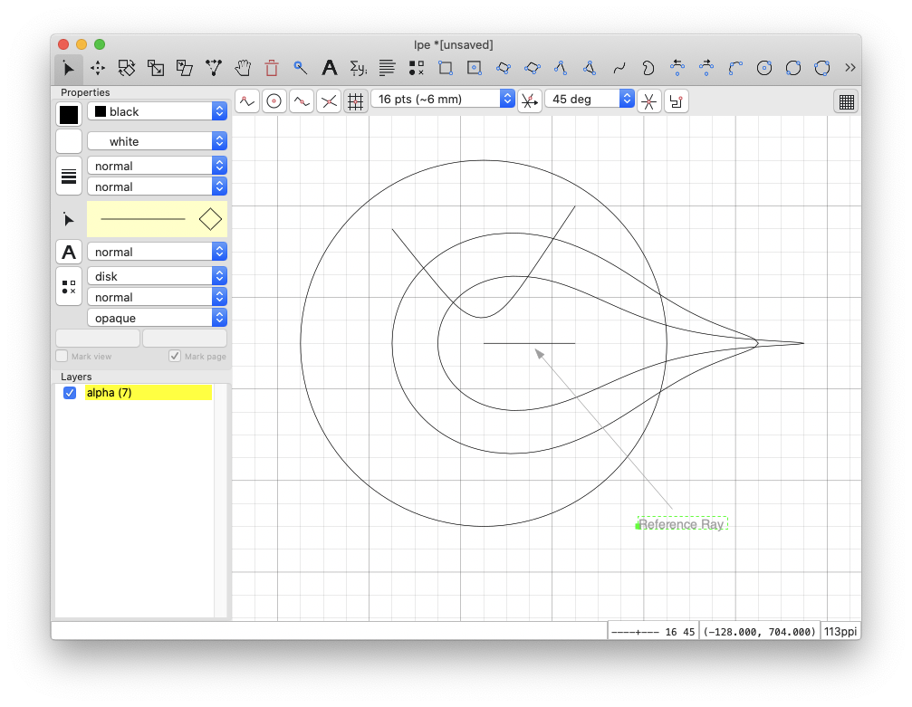

# native-hyperbolic-ipelet
An Ipelet that allows for drawing shapes using the native representation of hyperbolic space.

## Installation

Simply copy the `.lua` file to `~/.ipe/ipelets/` (or to some other directory for
ipelets).

## Usage

In the native representation of hyperbolic space, points are typically
represented using polar coordinates.  That is, after defining an origin and a
reference ray, points are identified by their hyperbolic distance to the origin
and the angular distance to the reference ray.

### Reference Ray

In this ipelet, the reference ray is defined using a Euclidean line segment.  In
addition to the origin (the starting point of the line segment) and the
orientation of the ray, it also defines the scaling that is used when projecting
the hyperbolic plane to the Euclidean canvas.  More precisely, the length of the
segment is considered to represent 4 units of length in hyperbolic space.

Before any drawing can be performed, the reference ray has to be defined.  To do
this, draw a Euclidean line segment and select `Ipelets -> Native Representation
-> Set Reference Ray`.  This needs to be done only once.

### Line Segment Tool

A hyperbolic line segment can be drawn by selecting `Ipelets -> Native
Representation -> Line Segment Tool` and placing the first endpoint of the
segment using the left mouse button.  Moving the cursor then displays where the
line segment will be drawn and the hyperbolic length of the line segment is
displayed in the lower left.  The currently displayed line segment is confirmed
by placing the second endpoint using the left mouse button.

### Circle Tool

A hyperbolic circle can be drawn by selecting `Ipelets -> Native Representation
-> Line Segment Tool`.  After placing the center using the left mouse button,
moving the cursor displays where the circle will be drawn and the hyperbolic
radius of the circle is displayed in the lower left.  The currently displayed
circle is confirmed using the left mouse button.
